# From-Scratch ML in Pure C

> GPT + DDPM + Flow Matching. No frameworks. No dependencies. Just C and math.

## Training Progression

| DDPM (Denoising Diffusion) | Flow Matching |
|:-:|:-:|
| 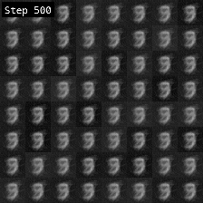 | 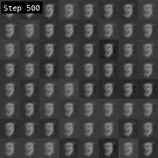 |
| 1000-step reverse process | 100-step Euler ODE |

## Loss Curves

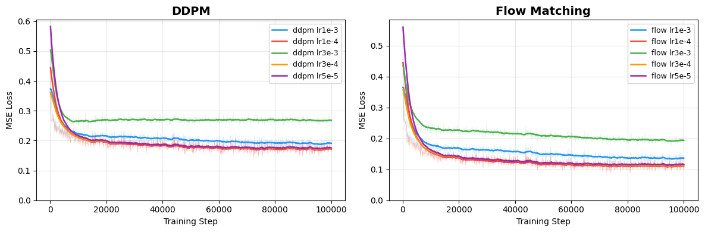

Same MLP architecture (~1.9M params), same MNIST data, five learning rates.

## Learning Rate Comparison (after 100K steps)

### DDPM

| lr = 5e-5 | lr = 1e-4 | lr = 3e-4 | lr = 1e-3 | lr = 3e-3 |
|:-:|:-:|:-:|:-:|:-:|
| 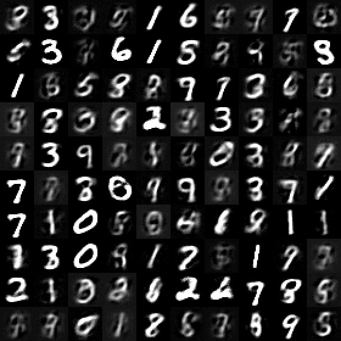 | 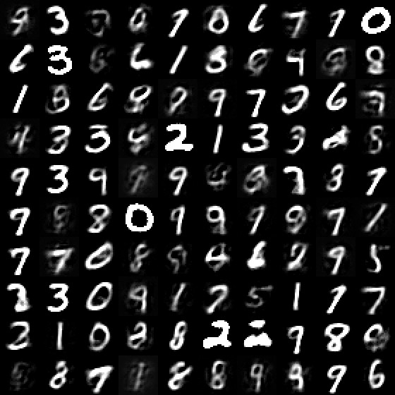 |  | 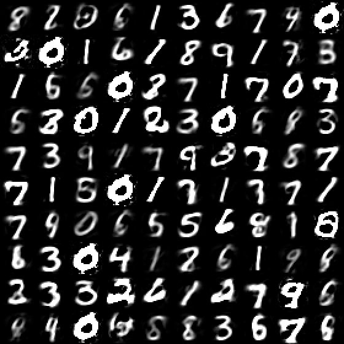 | 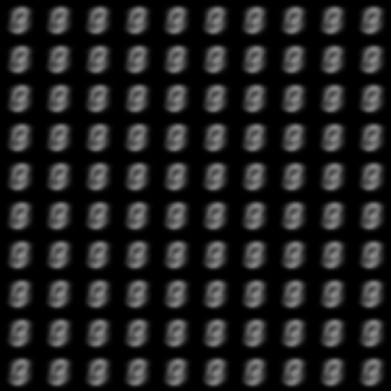 |

### Flow Matching

| lr = 5e-5 | lr = 1e-4 | lr = 3e-4 | lr = 1e-3 | lr = 3e-3 |
|:-:|:-:|:-:|:-:|:-:|
| 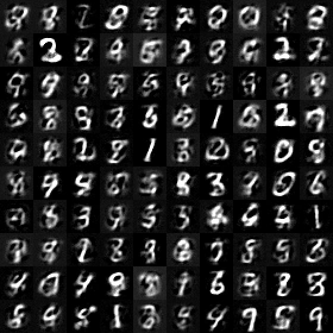 | 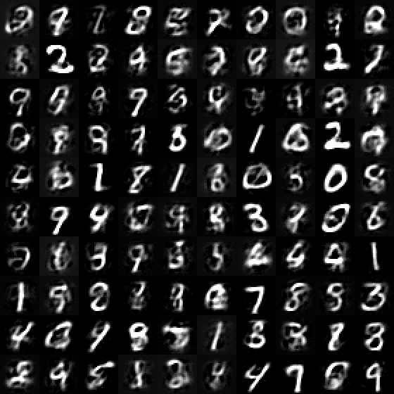 | 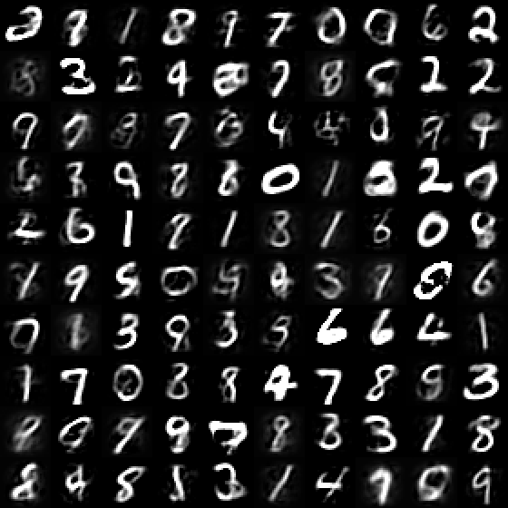 |  | 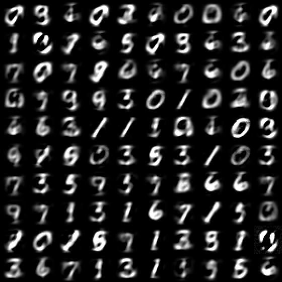 |

## What's Here

| File | What it does | Lines |
|------|-------------|-------|
| `gpt.c` | Character-level GPT transformer | ~770 |
| `diffusion.c` | DDPM image generator | ~750 |
| `flow_matching.c` | Flow Matching image generator | ~640 |

Every model is a single C file. No BLAS, no CUDA, no Python at training time -- just `gcc` and `-lm`.

## Quick Start

```bash
# Build everything
make diffusion flow_matching data

# Train a single model
./diffusion --lr 3e-4 --outdir output/my_ddpm
./flow_matching --lr 1e-4 --outdir output/my_flow

# Run all 10 experiments (5 LRs x 2 models) + GIFs + loss plots
./run_all.sh

# GPT text generation
make train
```

## Reference

The GPT implementation is based on [this post](https://x.com/TheVixhal/status/2022734079167467711) by [@TheVixhal](https://x.com/TheVixhal).
